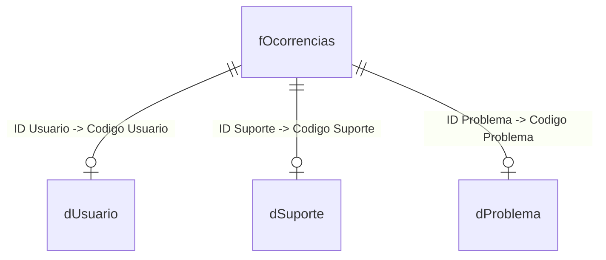

# 📊 Dashboard SAC (Serviço de Atendimento ao Consumidor)

Este repositório contém um projeto de **Power BI** focado na análise de métricas de atendimento ao cliente, performance da equipe de suporte e perfil dos usuários.

---

## 🏗️ Estrutura do Projeto

O projeto está organizado da seguinte forma:

*   **`Dashboard_SAC.pbip`**: Arquivo de inicialização do projeto no Power BI Desktop.
*   **`Dashboard_SAC.Report/`**: Contém a definição visual do relatório, páginas, visuais e configurações de layout.
*   **`Dashboard_SAC.SemanticModel/`**: Contém o modelo semântico estruturado em arquivos TMDL.
    *   `definition/tables/`: Arquivos `.tmdl` individuais para cada tabela e seus respectivos relacionamentos e medidas.

---

## 💾 Modelo de Dados (Star Schema)

O modelo semântico segue a arquitetura **Star Schema (Esquema Estrela)**, ideal para performance e facilidade de escrita de fórmulas DAX. Ele é composto por uma tabela fato (`fOcorrencias`) e três tabelas dimensão principais (`dUsuario`, `dSuporte`, `dProblema`).

### 📋 Detalhamento das Tabelas

#### 1. 📈 Tabela Fato: `fOcorrencias`
Contém o histórico e detalhes de todos os atendimentos realizados.
*   **Chaves de Relacionamento**: `ID Usuario`, `ID Suporte`, `ID Problema`.
*   **Campos de Data**: `Data Chamado`, `Data Resposta`.
*   **Campos de Performance**: `Tempo Atendimento (Min)` (calculado via ETL), `Qtd Dias p/ Resposta` (calculado via ETL), `Status` (Ex: "Cancelado", "Concluído", etc.).

#### 2. 👥 Tabela Dimensão: `dUsuario`
Armazena as informações demográficas e de cadastro dos clientes/usuários.
*   **Chave Primária**: `Codigo Usuario`.
*   **Campos**: `Usuário` (Nome formatado), `Sexo` (Masculino/Feminino), `Data de Nascimento`, `Data de inscrição`, `Idade`, `Faixa Etária` (Jovem, Adulto, Sênior).

#### 3. 🎧 Tabela Dimensão: `dSuporte`
Cadastro dos atendentes e analistas da equipe de suporte.
*   **Chave Primária**: `Codigo Suporte`.
*   **Campos**: `Nome Atendente`, `Sexo`, `Data de Nascimento`.

#### 4. 🛠️ Tabela Dimensão: `dProblema`
Categorização dos tipos de problemas reportados nos chamados.
*   **Chave Primária**: `Codigo Problema`.
*   **Campos**: `Problema` (Nome do problema/categoria).

---

## 🧮 Métricas e Medidas DAX

As seguintes medidas foram desenvolvidas para dar suporte às análises do dashboard:

| Medida DAX | Descrição | Fórmula / Implementação |
| :--- | :--- | :--- |
| **Total Atendimentos** | Quantidade total de chamados registrados. | `COUNTROWS(fOcorrencias)` |
| **Tempo Médio Atendimentos** | Tempo médio de duração de cada atendimento em minutos. | `AVERAGE(fOcorrencias[Tempo Atendimento (Min)])` |
| **Tempo Médio Retorno (Dias)** | Quantidade média de dias entre a abertura do chamado e a resposta. | `AVERAGE(fOcorrencias[Qtd Dias p/ Resposta])` |
| **Média Diária Chamados** | Média de chamados abertos por dia. | `[Total Atendimentos] / DISTINCTCOUNT(fOcorrencias[Data Chamado])` |
| **Chamados Cancelados** | Total de chamados que foram cancelados. | `CALCULATE([Total Atendimentos], fOcorrencias[Status] = "Cancelado")` |
| **% Cancelados** | Percentual de chamados cancelados sobre o total de atendimentos. | `[Chamados Cancelados] / [Total Atendimentos]` |

---

## ⚡ Processamento e Transformação de Dados (ETL / Power Query)

A extração dos dados é realizada a partir de uma planilha Excel (`Base SAC.xlsx`). Durante a carga, as seguintes etapas de transformação foram aplicadas via **Power Query (Linguagem M)** para garantir a qualidade dos dados:

### 🔄 Transformações na Fato (`fOcorrencias`):
1.  **Cálculo do Tempo de Atendimento**: Criado a partir da diferença de tempo entre `Hora Final` e `Hora Inicial`, convertido em minutos e arredondado para duas casas decimais.
2.  **Cálculo da Resolução**: Calculado o total de dias corridos entre `Data Resposta` e `Data Chamado`.

### 🔄 Transformações em `dUsuario`:
1.  **Tratamento de Nomes**: Conversão e limpeza de formato do nome do usuário (`Sobrenome, Nome` para `Nome Sobrenome`).
2.  **Padronização de Gênero**: Substituição das siglas `"M"` e `"F"` por `"Masculino"` e `"Feminino"`.
3.  **Cálculo de Idade Dinâmico**: Determinação da idade atual do usuário de forma dinâmica comparando a data atual (`DateTime.LocalNow()`) com a data de nascimento.
4.  **Segmentação por Faixa Etária**: Classificação lógica dos usuários em:
    *   **Jovem**: Menor ou igual a 29 anos.
    *   **Adulto**: Entre 30 e 39 anos.
    *   **Sênior**: Acima de 40 anos.

---

Desenvolvido com 📊 por **Maiko André**.